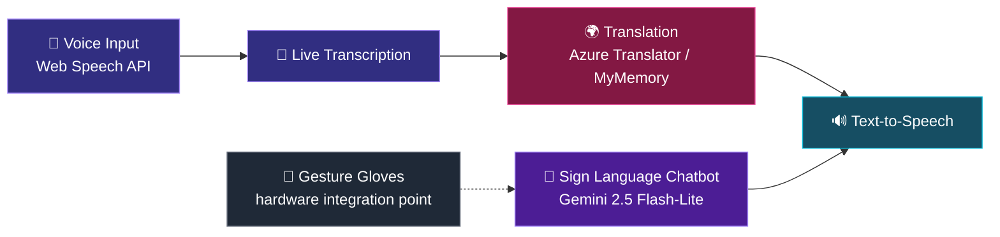

<!-- ─────────────────────────── HEADER ─────────────────────────── -->

<div align="center">


<a href="https://rubaitzk.vercel.app/">
  
</a>

<br/>

<a href="https://rubaitzk.vercel.app/"></a>
<a href="https://www.linkedin.com/in/rubaitzakria/"></a>


</div>

<br/>

<!-- ─────────────────────────── ABOUT ─────────────────────────── -->

## 👨‍💻 &nbsp;About Me


```python
class Rubait:
    name      = "Muhammad Rubait Zakria"
    studying  = "Software Engineering @ NUST"
    focus     = ["Intelligent Systems", "Scalable Backends", "ML Pipelines"]
    languages = ["Python", "Java", "JavaScript"]
    passion   = "Tech that makes communication more accessible"
    mindset   = "Build it right, then make it fast."

    def currently(self):
        return "Turning theory into systems that hold up in the real world."
```

I'm a **Software Engineering student at NUST** who loves the space where clean backend engineering meets machine learning. I like building systems that are reliable, scalable, and genuinely useful, especially ones that help people communicate across barriers of language and ability.

- 🎓 &nbsp;Software Engineering @ **NUST**
- ⚙️ &nbsp;Building **scalable backend systems** and clean APIs
- 🧠 &nbsp;Exploring **machine learning pipelines** from data to deployment
- 🤟 &nbsp;Interested in **accessibility tech**: speech, translation and sign language tools
- 🌱 &nbsp;Always sharpening fundamentals: data structures, system design, architecture
- 🤝 &nbsp;Open to collaborations, internships, and interesting problems

<br/>

<!-- ─────────────────────────── FEATURED PROJECT ─────────────────────────── -->

## 🚀 &nbsp;Featured Project: GestureVox Fusion Suite

<div align="center">

<a href="https://github.com/Rubaitzk/GestureVox-Fusion-Suite">
  
</a>

</div>

A web app that gives **sign language gestures a chat-style interface**, combined with real-time speech recognition, multi-language translation, and an AI chatbot for sign language guidance. Built as a Software Engineering subject project.

<div align="center">

| 🎤 Speech to Text | 🌍 Translation | 💬 AI Chatbot | 🔊 Text to Speech |
|:---:|:---:|:---:|:---:|
| Live voice input via Web Speech API | English, Urdu, Spanish, French | Sign language guide powered by Gemini | Language-aware voice playback |

</div>

<details>
<summary><b>🔍 How it works (click to expand)</b></summary>

<br/>



**Built with:** React 19 · Vite · Tailwind CSS · Lucide Icons · Web Speech API · Google Generative AI · Azure Translator · MyMemory API

</details>

<br/>

<!-- ─────────────────────────── TECH STACK ─────────────────────────── -->

## 🛠️ &nbsp;Tech Stack

<div align="center">

**Languages**


**Frontend**


**Backend & Tools**


**Exploring (ML)**


</div>

<br/>

<!-- ─────────────────────────── STATS ─────────────────────────── -->

## 📊 &nbsp;GitHub Stats

<div align="center">


<br/>


<br/><br/>


</div>

<br/>

<div align="center">

### 🏆 Trophies


</div>

<br/>

<!-- ─────────────────────────── ACTIVITY + SNAKE ─────────────────────────── -->

## 📈 &nbsp;Contribution Activity

<div align="center">


<br/>

### 🐍 The snake is eating my contributions

<picture>
  <source media="(prefers-color-scheme: dark)" srcset="https://raw.githubusercontent.com/Rubaitzk/Rubaitzk/output/github-snake-dark.svg" />
  <source media="(prefers-color-scheme: light)" srcset="https://raw.githubusercontent.com/Rubaitzk/Rubaitzk/output/github-snake.svg" />
  
</picture>

</div>

<br/>

<!-- ─────────────────────────── CONNECT ─────────────────────────── -->

## 🤝 &nbsp;Let's Connect

<div align="center">

I'm always happy to talk about backend engineering, machine learning, accessibility tech, or ideas worth building.

<br/><br/>

<a href="https://www.linkedin.com/in/rubaitzakria/"></a>
<a href="https://rubaitzk.vercel.app/"></a>
<a href="https://github.com/Rubaitzk"></a>

</div>

<br/>

<!-- ─────────────────────────── FOOTER ─────────────────────────── -->

<div align="center">


<br/>

**⭐ Found something useful? Drop a star on my repos, it means a lot! ⭐**


</div>
