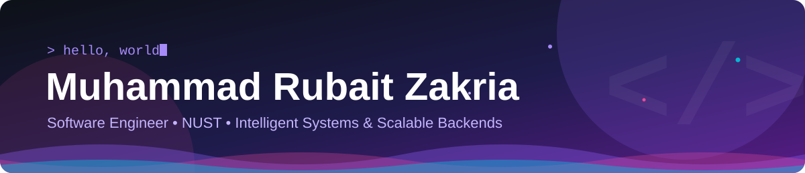
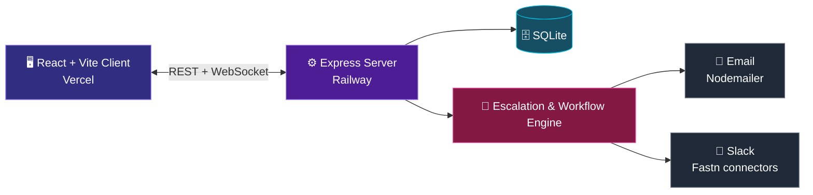

<!-- ─────────────────────────── HEADER ─────────────────────────── -->

<div align="center">



<a href="https://rubaitzk.vercel.app/">
  
</a>

<br/>

<a href="https://rubaitzk.vercel.app/"></a>
<a href="https://www.linkedin.com/in/rubaitzakria/"></a>
<a href="https://alertflow-two.vercel.app/"></a>


</div>

<br/>

<!-- ─────────────────────────── ABOUT ─────────────────────────── -->

## 👨‍💻 &nbsp;About Me


```python
class Rubait:
    name      = "Muhammad Rubait Zakria"
    studying  = "Software Engineering @ NUST"
    focus     = ["Intelligent Systems", "Scalable Backends", "ML Pipelines"]
    languages = ["Python", "Java", "JavaScript"]
    mindset   = "Build it right, then make it fast."

    def currently(self):
        return "Turning theory into systems that hold up in the real world."
```

I'm a **Software Engineering student at NUST** who loves the space where clean backend engineering meets machine learning. I like building systems that are reliable, scalable, and genuinely useful.

- 🎓 &nbsp;Software Engineering @ **NUST**
- ⚙️ &nbsp;Building **scalable backend systems** and clean APIs
- ⚡ &nbsp;Building **real-time, reliability-focused tools** like AlertFlow
- 🧠 &nbsp;Exploring **machine learning pipelines** from data to deployment
- 🌱 &nbsp;Always sharpening fundamentals: data structures, system design, architecture
- 🤝 &nbsp;Open to collaborations, internships, and interesting problems

<br/>

<!-- ─────────────────────────── FEATURED PROJECT ─────────────────────────── -->

## 🚀 &nbsp;Featured Project: AlertFlow

<div align="center">

<a href="https://github.com/Rubaitzk/AlertFlow">
  
</a>

<br/>

<a href="https://alertflow-two.vercel.app/"></a>

</div>

<br/>

A **real-time incident management, alerting and on-call platform** for engineering teams. It helps teams detect, triage, escalate and resolve infrastructure incidents faster.

<div align="center">

| ⚡ Live Triage | 📅 On-Call | 🌐 Service Catalog | 📊 Analytics |
|:---:|:---:|:---:|:---:|
| Real-time incident updates over WebSockets, with P1 to P4 severities | Rotations and multi-tier escalation policies | Service health, SLAs and dependency mapping | MTTR, MTTD, SLA compliance and post-mortems |

</div>

<details>
<summary><b>🔍 Architecture (click to expand)</b></summary>

<br/>



**Built with:** React · Vite · React Router · Recharts · Node.js · Express · WebSockets · SQLite · Nodemailer · Fastn

</details>

<br/>

<!-- ─────────────────────────── TECH STACK ─────────────────────────── -->

## 🛠️ &nbsp;Tech Stack

<div align="center">

**Languages**


**Frontend**


**Backend & Data**


**Tools & Platforms**


**Exploring (ML)**


</div>

<br/>

<!-- ─────────────────────────── STATS ─────────────────────────── -->

## 📊 &nbsp;GitHub Stats

<div align="center">


<br/>


</div>

<br/>

<!-- ─────────────────────────── SNAKE ─────────────────────────── -->

## 🐍 &nbsp;Contribution Snake

<div align="center">

<picture>
  <source media="(prefers-color-scheme: dark)" srcset="https://raw.githubusercontent.com/Rubaitzk/Rubaitzk/output/github-snake-dark.svg" />
  <source media="(prefers-color-scheme: light)" srcset="https://raw.githubusercontent.com/Rubaitzk/Rubaitzk/output/github-snake.svg" />
  
</picture>

</div>

<br/>

<!-- ─────────────────────────── CONNECT ─────────────────────────── -->

## 🤝 &nbsp;Let's Connect

<div align="center">

I'm always happy to talk about backend engineering, machine learning, real-time systems, or ideas worth building.

<br/><br/>

<a href="https://www.linkedin.com/in/rubaitzakria/"></a>
<a href="https://rubaitzk.vercel.app/"></a>
<a href="https://github.com/Rubaitzk"></a>

<br/><br/>


</div>